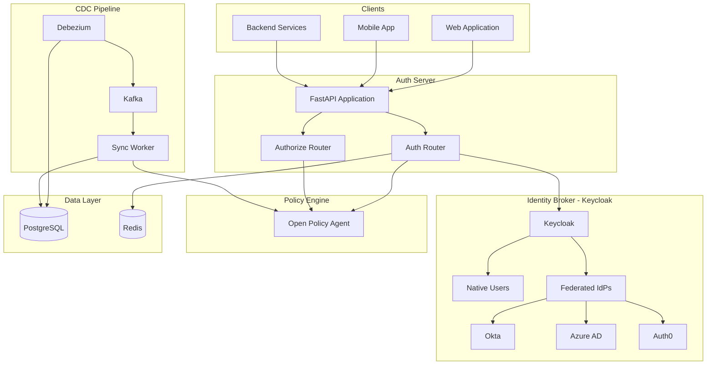
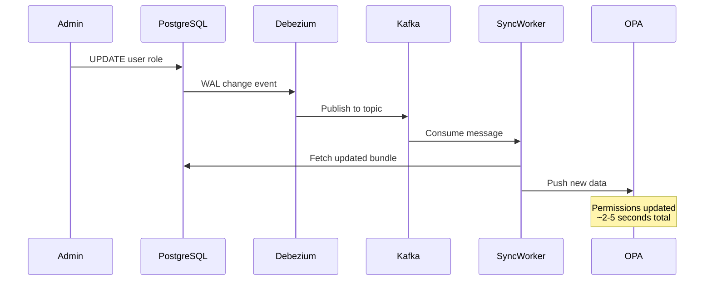
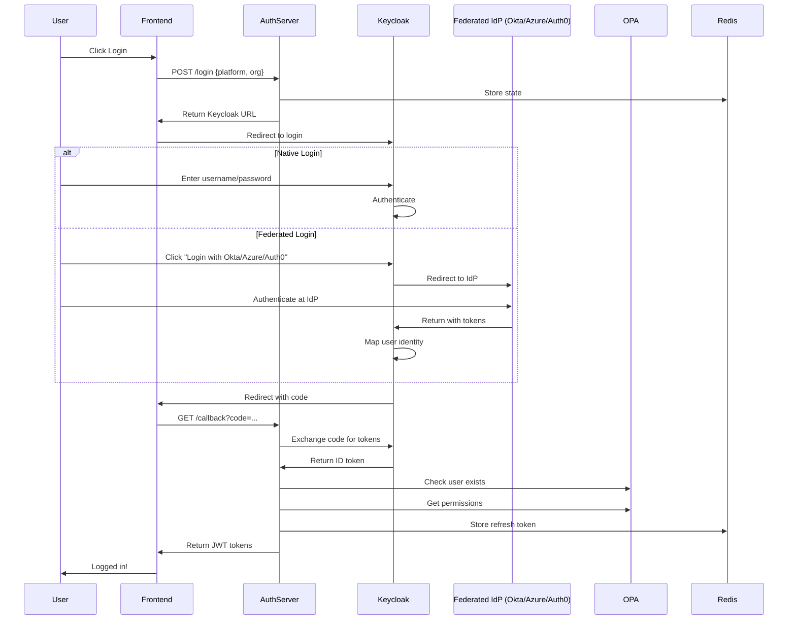
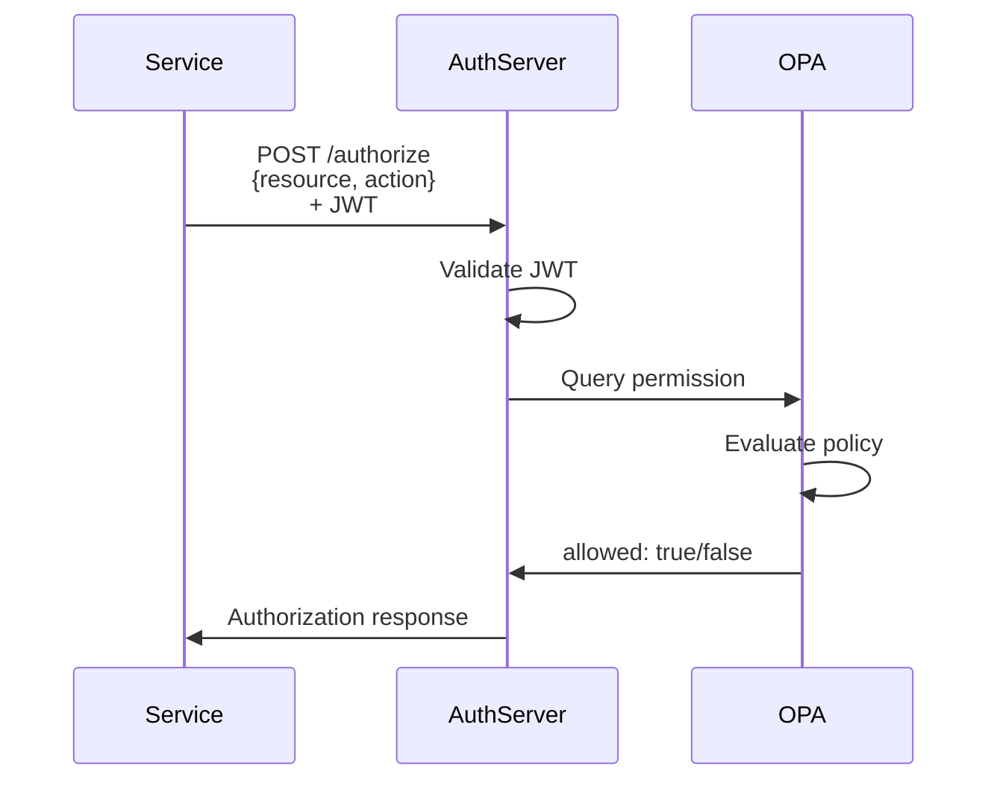

# System Architecture

## Overview

The User Management System is built on a modern, microservices architecture designed for scalability, security, and real-time responsiveness.

## High-Level Architecture

## Component Details

### 1. Auth Server (FastAPI)

The central authentication and authorization service.

| Component | Purpose |
|-----------|---------|
| **Auth Router** | Handles login, callback, refresh, logout |
| **Authorize Router** | Handles permission checks |
| **Token Service** | JWT creation and validation |
| **Session Service** | Redis-based session management |
| **OPA Service** | Queries OPA for authorization |
| **SSO Service** | OIDC/OAuth flow with IdP |

**Technology:** Python 3.11, FastAPI, Pydantic

### 2. Identity Broker (Keycloak)

Keycloak acts as an Identity Broker, providing a unified authentication layer.

| Responsibility | Description |
|----------------|-------------|
| Native Authentication | Username/password login directly to Keycloak |
| Identity Brokering | Federated SSO with external IdPs (Okta, Azure AD, Auth0) |
| MFA | Multi-factor authentication |
| User Federation | Optional LDAP/AD integration |
| Session Management | SSO sessions across applications |

**Supported IdP Protocols:** 
- OAuth 2.0 / OpenID Connect
- SAML 2.0
- Social Logins (Google, GitHub, etc.)

**Key URLs:**
| Endpoint | URL Pattern |
|----------|-------------|
| Authorization | `/realms/{realm}/protocol/openid-connect/auth` |
| Token | `/realms/{realm}/protocol/openid-connect/token` |
| JWKS | `/realms/{realm}/protocol/openid-connect/certs` |
| UserInfo | `/realms/{realm}/protocol/openid-connect/userinfo` |

### 3. Open Policy Agent (OPA)

Policy decision point for authorization.

| Responsibility | Description |
|----------------|-------------|
| Permission Checks | Evaluates if user can perform action |
| Policy Enforcement | Enforces RBAC rules |
| Data Store | Holds synced user/permission data |

**Policy Language:** Rego

### 4. PostgreSQL Database

Persistent storage for RBAC data.

| Table Pattern | Contents |
|---------------|----------|
| `{platform}_orgs` | Organizations/tenants |
| `{platform}_roles` | Role definitions |
| `{platform}_perms` | Resource permissions |
| `{platform}_users` | User assignments |

**Features:** WAL for CDC, UUID primary keys

### 5. Redis

In-memory data store for sessions.

| Use Case | TTL |
|----------|-----|
| Login State | 10 minutes |
| Refresh Tokens | 30 days |
| Revoked Tokens | Until original expiry |

### 6. CDC Pipeline (Debezium + Kafka)

Real-time data synchronization from PostgreSQL to OPA.

## Data Flow

### Authentication Flow

### Authorization Flow

## Security Architecture

### Token Security

| Token Type | Lifetime | Storage | Contains |
|------------|----------|---------|----------|
| Access Token | 1 hour | Client memory | User info, permissions |
| Refresh Token | 30 days | Redis + Client | User email, platform |
| ID Token | N/A (from IdP) | Not stored | Identity claims |

### Security Measures

1. **HTTPS** - All communication encrypted in transit
2. **JWT Signing** - Tokens signed with HS256
3. **State Parameter** - CSRF protection in OAuth flow
4. **Token Revocation** - Refresh tokens can be revoked
5. **Short Expiry** - Access tokens expire in 1 hour

## Scalability

### Horizontal Scaling

| Component | Scaling Strategy |
|-----------|------------------|
| Auth Server | Stateless, scale with load balancer |
| OPA | Replicate with synced data |
| Redis | Redis Cluster for HA |
| PostgreSQL | Read replicas for queries |

### Performance Considerations

- JWT validation is local (no network call)
- OPA queries are fast (~1-5ms)
- Redis operations are sub-millisecond
- CDC provides eventual consistency (~2-5s)

## Disaster Recovery

| Component | Recovery Strategy |
|-----------|-------------------|
| PostgreSQL | Point-in-time recovery, replicas |
| Redis | Persistence + replicas |
| OPA | Stateless, re-sync from PostgreSQL |
| Auth Server | Stateless, redeploy |
