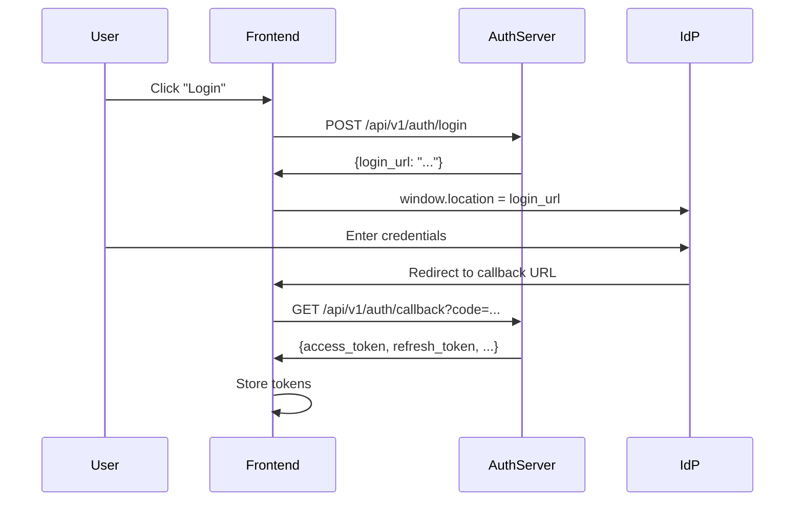

# Integration Guide

This guide explains how to integrate your services with the User Management System.

## Overview

There are two main integration patterns:

1. **Frontend Integration** - For web/mobile apps that need to log users in
2. **Backend Integration** - For services that need to verify user permissions

## Frontend Integration

### Login Flow



### JavaScript/TypeScript Example

```typescript
// auth.ts - Authentication service

const AUTH_SERVER = 'http://localhost:8000/api/v1';

interface LoginResponse {
  login_url: string;
}

interface TokenResponse {
  access_token: string;
  refresh_token: string;
  expires_in: number;
}

// Step 1: Initiate login
async function initiateLogin(platform: string, orgName: string): Promise<string> {
  const response = await fetch(`${AUTH_SERVER}/auth/login`, {
    method: 'POST',
    headers: { 'Content-Type': 'application/json' },
    body: JSON.stringify({ platform, org_name: orgName }),
  });

  if (!response.ok) {
    throw new Error('Failed to initiate login');
  }

  const data: LoginResponse = await response.json();
  return data.login_url;
}

// Step 2: Redirect to IdP
function redirectToIdP(loginUrl: string): void {
  window.location.href = loginUrl;
}

// Step 3: Handle callback (in your callback page)
async function handleCallback(): Promise<TokenResponse> {
  const params = new URLSearchParams(window.location.search);
  const code = params.get('code');
  const state = params.get('state');

  if (!code || !state) {
    throw new Error('Missing code or state');
  }

  const response = await fetch(
    `${AUTH_SERVER}/auth/callback?code=${code}&state=${state}`
  );

  if (!response.ok) {
    const error = await response.json();
    throw new Error(error.detail);
  }

  return response.json();
}

// Step 4: Store tokens
function storeTokens(tokens: TokenResponse): void {
  localStorage.setItem('access_token', tokens.access_token);
  localStorage.setItem('refresh_token', tokens.refresh_token);
  localStorage.setItem('token_expiry', String(Date.now() + tokens.expires_in * 1000));
}

// Step 5: Refresh token when needed
async function refreshToken(): Promise<TokenResponse> {
  const refreshToken = localStorage.getItem('refresh_token');
  
  const response = await fetch(`${AUTH_SERVER}/auth/refresh`, {
    method: 'POST',
    headers: { 'Content-Type': 'application/json' },
    body: JSON.stringify({ refresh_token: refreshToken }),
  });

  if (!response.ok) {
    // Refresh failed, redirect to login
    localStorage.clear();
    window.location.href = '/login';
    throw new Error('Session expired');
  }

  const tokens: TokenResponse = await response.json();
  storeTokens(tokens);
  return tokens;
}

// Step 6: Get valid access token (auto-refresh if needed)
async function getAccessToken(): Promise<string> {
  const expiry = Number(localStorage.getItem('token_expiry'));
  const buffer = 60000; // Refresh 1 minute before expiry

  if (Date.now() > expiry - buffer) {
    await refreshToken();
  }

  return localStorage.getItem('access_token') || '';
}

// Step 7: Make authenticated API calls
async function authenticatedFetch(url: string, options: RequestInit = {}): Promise<Response> {
  const token = await getAccessToken();
  
  return fetch(url, {
    ...options,
    headers: {
      ...options.headers,
      'Authorization': `Bearer ${token}`,
    },
  });
}

// Step 8: Logout
async function logout(): Promise<void> {
  const refreshToken = localStorage.getItem('refresh_token');
  
  await fetch(`${AUTH_SERVER}/auth/logout`, {
    method: 'POST',
    headers: { 'Content-Type': 'application/json' },
    body: JSON.stringify({ refresh_token: refreshToken }),
  });

  localStorage.clear();
  window.location.href = '/login';
}
```

### React Hook Example

```typescript
// useAuth.ts

import { useState, useEffect, createContext, useContext } from 'react';

interface User {
  email: string;
  organization: string;
  permissions: Record<string, any>;
}

interface AuthContextType {
  user: User | null;
  loading: boolean;
  login: (platform: string, org: string) => Promise<void>;
  logout: () => Promise<void>;
  hasPermission: (resource: string, action: string) => boolean;
}

const AuthContext = createContext<AuthContextType | null>(null);

export function AuthProvider({ children }) {
  const [user, setUser] = useState<User | null>(null);
  const [loading, setLoading] = useState(true);

  useEffect(() => {
    // Check for existing session on mount
    const token = localStorage.getItem('access_token');
    if (token) {
      // Decode JWT to get user info (or call /authorize/me)
      fetchUserInfo().then(setUser).finally(() => setLoading(false));
    } else {
      setLoading(false);
    }
  }, []);

  const login = async (platform: string, org: string) => {
    const response = await fetch('/api/v1/auth/login', {
      method: 'POST',
      headers: { 'Content-Type': 'application/json' },
      body: JSON.stringify({ platform, org_name: org }),
    });
    const { login_url } = await response.json();
    window.location.href = login_url;
  };

  const logout = async () => {
    const refreshToken = localStorage.getItem('refresh_token');
    await fetch('/api/v1/auth/logout', {
      method: 'POST',
      headers: { 'Content-Type': 'application/json' },
      body: JSON.stringify({ refresh_token: refreshToken }),
    });
    localStorage.clear();
    setUser(null);
    window.location.href = '/login';
  };

  const hasPermission = (resource: string, action: string): boolean => {
    if (!user?.permissions) return false;
    return user.permissions[resource]?.[action] === true;
  };

  return (
    <AuthContext.Provider value={{ user, loading, login, logout, hasPermission }}>
      {children}
    </AuthContext.Provider>
  );
}

export const useAuth = () => useContext(AuthContext);
```

---

## Backend Integration

### Python Example

```python
# auth_client.py

import httpx
from functools import wraps
from fastapi import HTTPException, Depends, Header

AUTH_SERVER = "http://auth-server:8000/api/v1"


async def verify_token(authorization: str = Header(...)) -> dict:
    """
    Verify JWT token and get user info.
    Use as a FastAPI dependency.
    """
    if not authorization.startswith("Bearer "):
        raise HTTPException(status_code=401, detail="Invalid authorization header")
    
    token = authorization.replace("Bearer ", "")
    
    async with httpx.AsyncClient() as client:
        response = await client.get(
            f"{AUTH_SERVER}/authorize/me",
            headers={"Authorization": f"Bearer {token}"}
        )
    
    if response.status_code != 200:
        raise HTTPException(status_code=401, detail="Invalid token")
    
    return response.json()


async def check_permission(
    resource: str,
    action: str,
    authorization: str = Header(...)
) -> dict:
    """
    Check if user has permission for resource/action.
    """
    token = authorization.replace("Bearer ", "")
    
    async with httpx.AsyncClient() as client:
        response = await client.post(
            f"{AUTH_SERVER}/authorize",
            headers={"Authorization": f"Bearer {token}"},
            json={"resource": resource, "action": action}
        )
    
    if response.status_code != 200:
        raise HTTPException(status_code=401, detail="Invalid token")
    
    result = response.json()
    if not result["allowed"]:
        raise HTTPException(status_code=403, detail="Permission denied")
    
    return result


# Usage in FastAPI
from fastapi import FastAPI, Depends

app = FastAPI()


@app.get("/projects")
async def list_projects(user: dict = Depends(verify_token)):
    """List projects - requires valid token"""
    # user contains: email, user_id, organization, permissions
    return {"projects": [...], "user": user["email"]}


@app.post("/projects")
async def create_project(
    auth: dict = Depends(lambda a=Header(...): check_permission("projects", "write", a))
):
    """Create project - requires write permission"""
    return {"created": True}


# Or use permissions from JWT directly (faster, no network call)
@app.delete("/projects/{project_id}")
async def delete_project(
    project_id: str,
    user: dict = Depends(verify_token)
):
    """Delete project - check permission from JWT"""
    if not user["permissions"].get("projects", {}).get("delete"):
        raise HTTPException(status_code=403, detail="Permission denied")
    
    return {"deleted": project_id}
```

### Go Example

```go
// auth_client.go

package auth

import (
    "encoding/json"
    "fmt"
    "net/http"
)

const AuthServer = "http://auth-server:8000/api/v1"

type User struct {
    Email        string                 `json:"email"`
    UserID       string                 `json:"user_id"`
    Organization string                 `json:"organization"`
    Platform     string                 `json:"platform"`
    Permissions  map[string]interface{} `json:"permissions"`
    IsOrgAdmin   int                    `json:"is_org_admin"`
}

type AuthorizeRequest struct {
    Resource string `json:"resource"`
    Action   string `json:"action"`
}

type AuthorizeResponse struct {
    Allowed      bool   `json:"allowed"`
    UserID       string `json:"user_id"`
    Organization string `json:"organization"`
    Role         string `json:"role"`
}

// VerifyToken validates the JWT and returns user info
func VerifyToken(token string) (*User, error) {
    req, _ := http.NewRequest("GET", AuthServer+"/authorize/me", nil)
    req.Header.Set("Authorization", "Bearer "+token)

    resp, err := http.DefaultClient.Do(req)
    if err != nil {
        return nil, err
    }
    defer resp.Body.Close()

    if resp.StatusCode != 200 {
        return nil, fmt.Errorf("invalid token")
    }

    var user User
    json.NewDecoder(resp.Body).Decode(&user)
    return &user, nil
}

// CheckPermission verifies user has permission for resource/action
func CheckPermission(token, resource, action string) (*AuthorizeResponse, error) {
    body, _ := json.Marshal(AuthorizeRequest{Resource: resource, Action: action})
    
    req, _ := http.NewRequest("POST", AuthServer+"/authorize", bytes.NewReader(body))
    req.Header.Set("Authorization", "Bearer "+token)
    req.Header.Set("Content-Type", "application/json")

    resp, err := http.DefaultClient.Do(req)
    if err != nil {
        return nil, err
    }
    defer resp.Body.Close()

    var result AuthorizeResponse
    json.NewDecoder(resp.Body).Decode(&result)
    return &result, nil
}

// Middleware for HTTP handlers
func AuthMiddleware(next http.Handler) http.Handler {
    return http.HandlerFunc(func(w http.ResponseWriter, r *http.Request) {
        token := r.Header.Get("Authorization")
        if token == "" {
            http.Error(w, "Unauthorized", http.StatusUnauthorized)
            return
        }

        user, err := VerifyToken(strings.TrimPrefix(token, "Bearer "))
        if err != nil {
            http.Error(w, "Invalid token", http.StatusUnauthorized)
            return
        }

        // Add user to context
        ctx := context.WithValue(r.Context(), "user", user)
        next.ServeHTTP(w, r.WithContext(ctx))
    })
}
```

---

## Best Practices

### 1. Token Storage (Frontend)

| Storage | Use Case | Security |
|---------|----------|----------|
| `localStorage` | Simple apps | Vulnerable to XSS |
| `sessionStorage` | Tab-specific sessions | Vulnerable to XSS |
| HTTP-only cookies | Production apps | CSRF protection needed |
| Memory | Maximum security | Lost on refresh |

**Recommendation:** Use HTTP-only cookies with CSRF tokens for production.

### 2. Token Refresh Strategy

```typescript
// Proactive refresh - refresh before expiry
const REFRESH_BUFFER = 60 * 1000; // 1 minute

async function getValidToken(): Promise<string> {
  const expiry = Number(localStorage.getItem('token_expiry'));
  
  if (Date.now() > expiry - REFRESH_BUFFER) {
    await refreshToken();
  }
  
  return localStorage.getItem('access_token')!;
}
```

### 3. Permission Checking

**Option A: Check JWT claims (fast, offline)**
```typescript
function hasPermission(user: User, resource: string, action: string): boolean {
  return user.permissions?.[resource]?.[action] === true;
}
```

**Option B: Call /authorize endpoint (always current)**
```typescript
async function hasPermission(resource: string, action: string): Promise<boolean> {
  const response = await authenticatedFetch('/api/v1/authorize', {
    method: 'POST',
    body: JSON.stringify({ resource, action }),
  });
  const result = await response.json();
  return result.allowed;
}
```

**Recommendation:** Use JWT claims for UI rendering, use /authorize for critical operations.

### 4. Error Handling

```typescript
async function handleAuthError(response: Response): Promise<void> {
  if (response.status === 401) {
    // Token expired or invalid
    try {
      await refreshToken();
      // Retry original request
    } catch {
      // Refresh failed, redirect to login
      window.location.href = '/login';
    }
  } else if (response.status === 403) {
    // Permission denied
    showError('You do not have permission to perform this action');
  }
}
```

### 5. Logout Everywhere

To log out from all devices, the user needs to revoke all refresh tokens. This requires server-side support (tracking all refresh tokens per user).

---

## Testing Integration

### Mock Auth Server

For testing, you can mock the auth server:

```typescript
// __mocks__/auth.ts

export const mockUser = {
  email: 'test@example.com',
  user_id: 'test-user-id',
  organization: 'test-org',
  permissions: {
    projects: { read: true, write: true, delete: false },
  },
};

export const mockTokens = {
  access_token: 'mock-access-token',
  refresh_token: 'mock-refresh-token',
  expires_in: 3600,
};
```

### Integration Tests

```typescript
describe('Auth Integration', () => {
  it('should complete login flow', async () => {
    // 1. Initiate login
    const loginResponse = await fetch('/api/v1/auth/login', {
      method: 'POST',
      body: JSON.stringify({ platform: 'mlops', org_name: 'test' }),
    });
    expect(loginResponse.ok).toBe(true);
    
    // 2. Verify login_url is returned
    const { login_url } = await loginResponse.json();
    expect(login_url).toContain('oauth2');
  });

  it('should validate token', async () => {
    const response = await fetch('/api/v1/authorize/me', {
      headers: { Authorization: `Bearer ${validToken}` },
    });
    expect(response.ok).toBe(true);
    
    const user = await response.json();
    expect(user.email).toBeDefined();
  });
});
```
