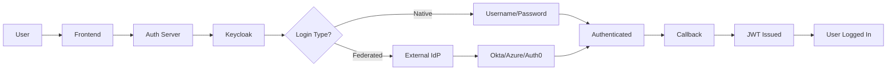
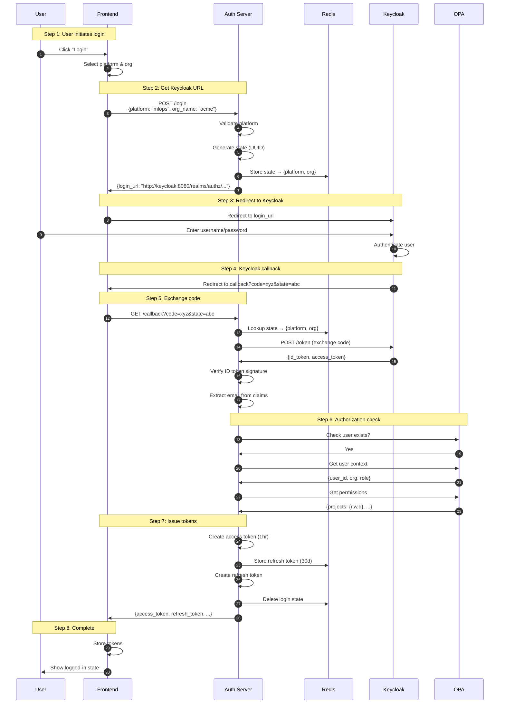
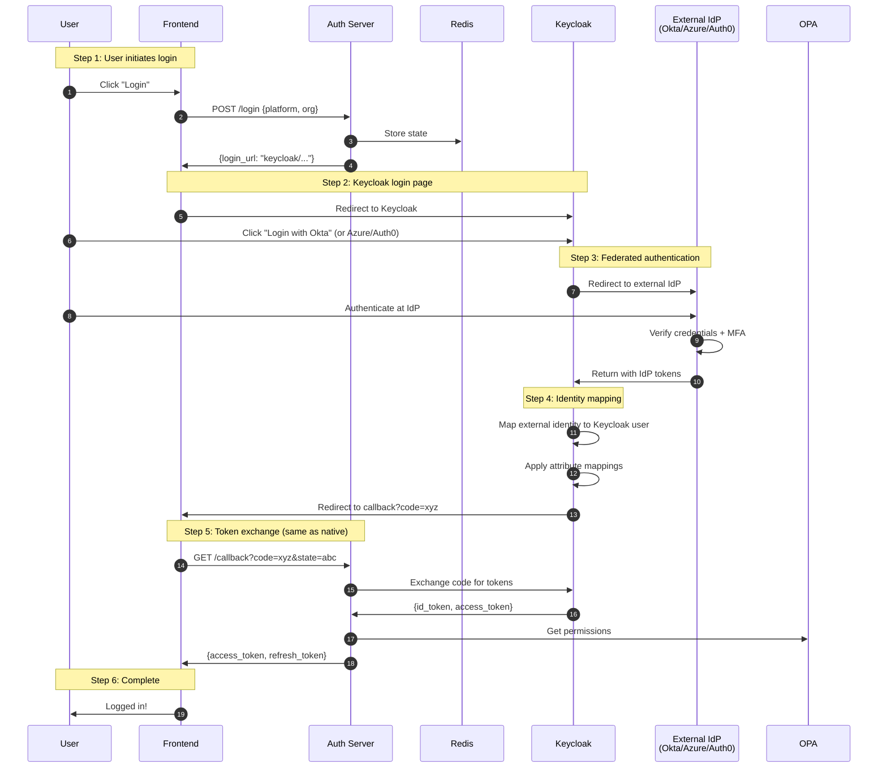
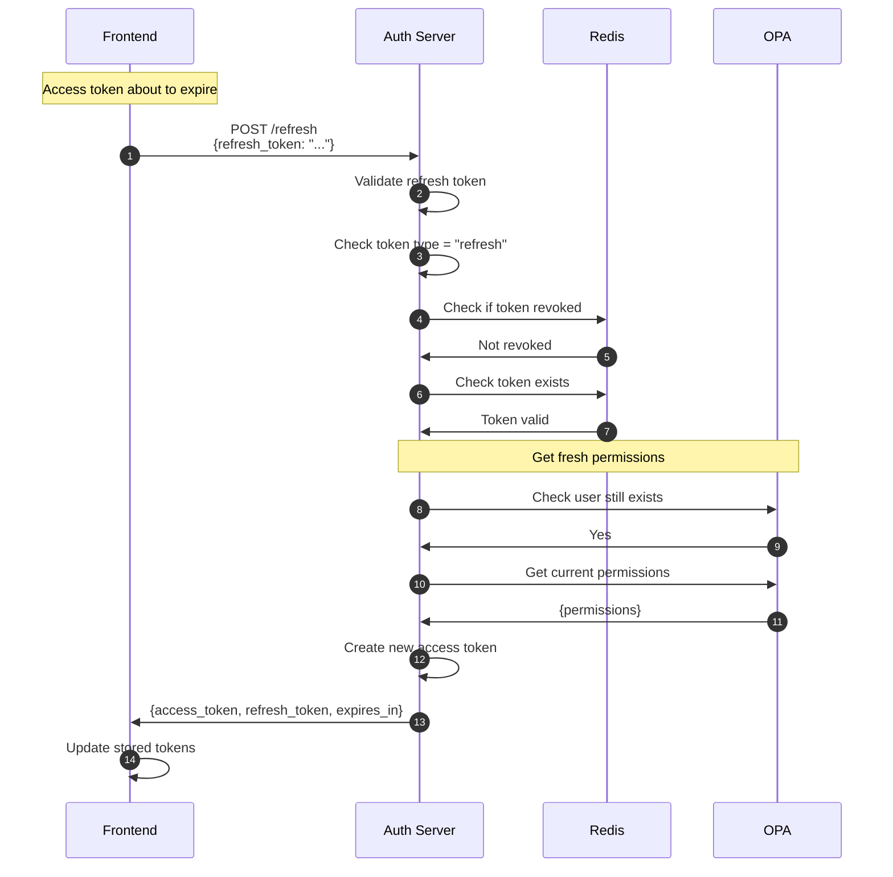
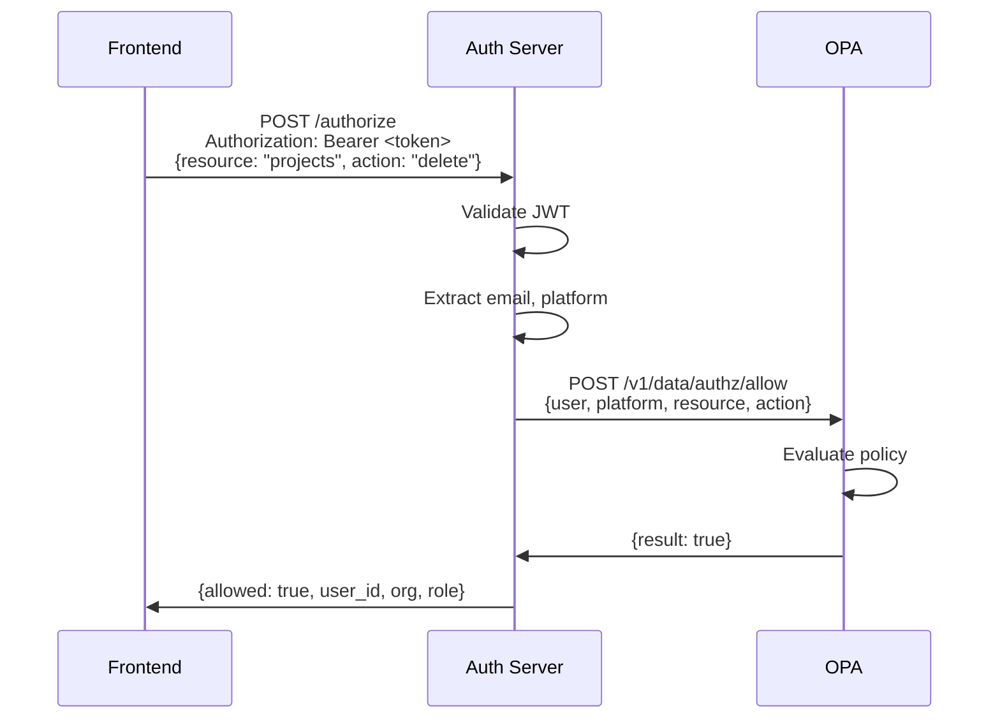
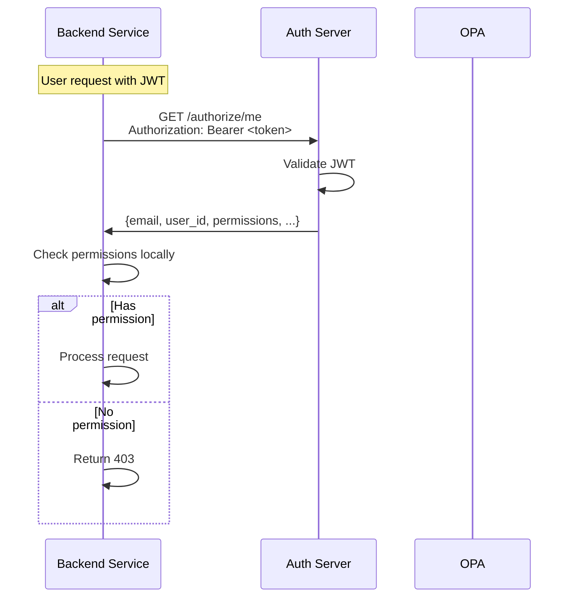
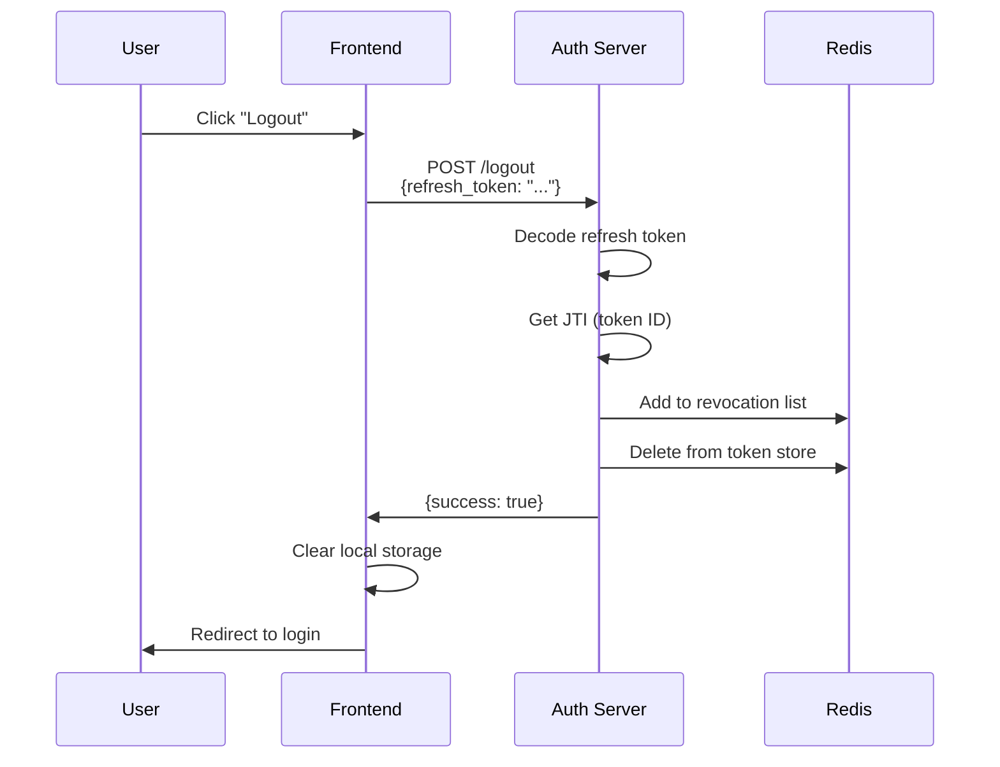
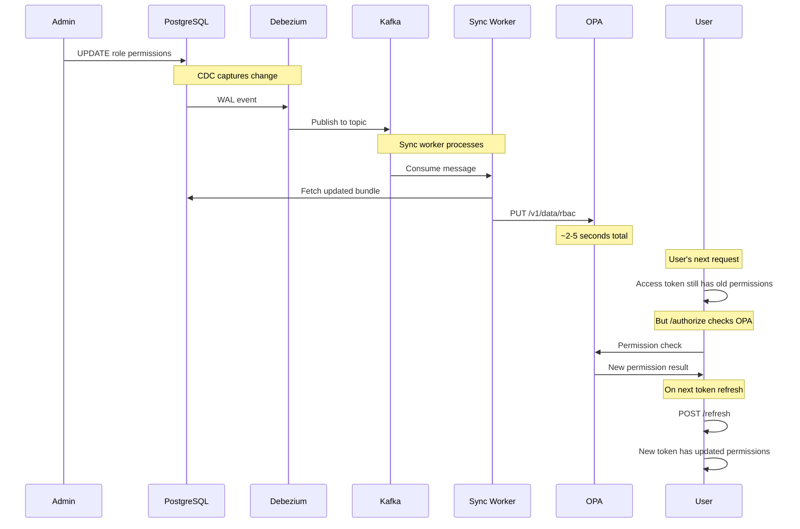
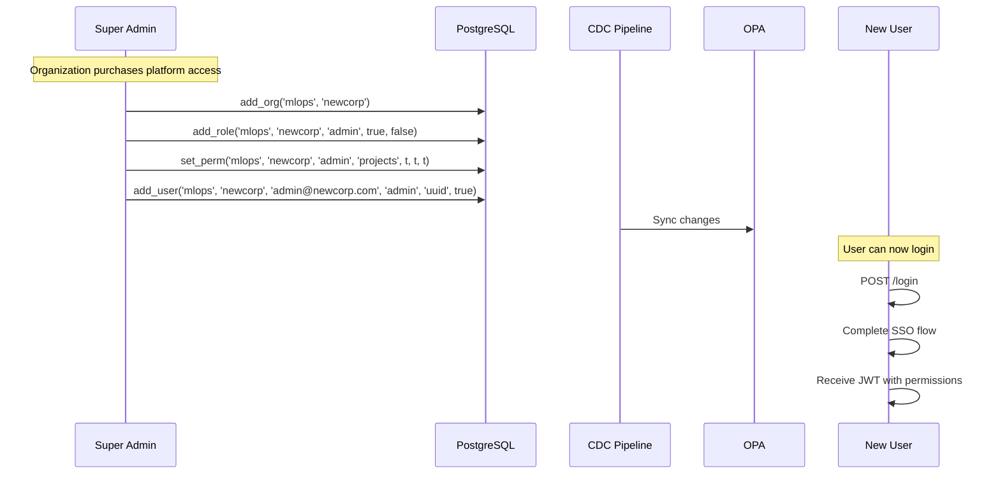
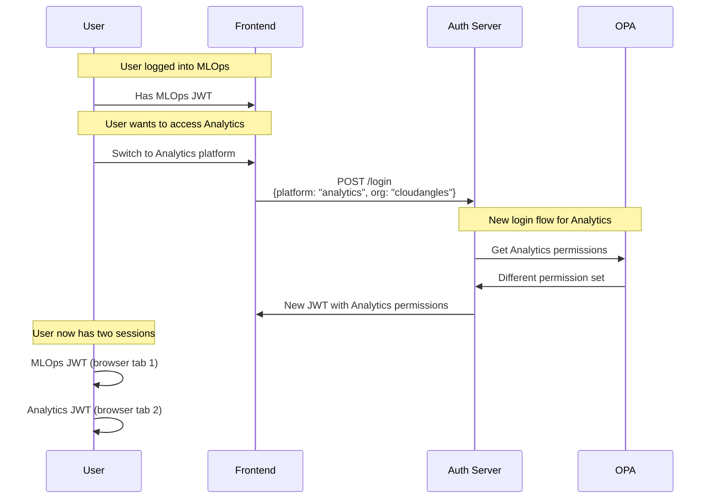

# User Flows

Visual diagrams of the main user flows in the system.

## 1. Login Flow

### Overview

Keycloak acts as an Identity Broker, supporting both native authentication and federated SSO with external IdPs.

### Detailed Flow (Native Login)

### Detailed Flow (Federated Login via Okta/Azure/Auth0)

## 2. Token Refresh Flow

### When to Refresh

- Access token expires (1 hour)
- Before token expiry (proactive refresh)
- After 401 response (reactive refresh)

### Flow Diagram

## 3. Authorization Check Flow

### From Frontend

### From Backend Service

## 4. Logout Flow

## 5. Permission Change Flow

### What happens when admin changes user permissions

## 6. User Registration Flow (Current: Pre-provisioned)

## 7. Multi-Platform Access

### User accessing different platforms

## Flow Summary

| Flow | Trigger | Result |
|------|---------|--------|
| **Login** | User clicks login | JWT tokens issued |
| **Refresh** | Token expiring | New access token |
| **Authorize** | Protected action | Allow/deny decision |
| **Logout** | User clicks logout | Tokens revoked |
| **Permission Change** | Admin updates role | OPA data updated |
| **User Registration** | Admin adds user | User can login |
