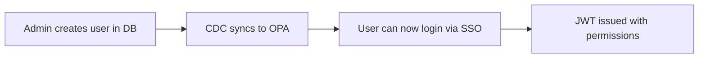

# User Initialization Guide

Step-by-step guide for initializing and managing users in the system.

## Overview

The User Management System uses a **pre-provisioned** user model:
1. Administrators create organizations, roles, and users in the database
2. Users can then log in via SSO
3. Changes sync automatically to OPA via CDC



## Prerequisites

Before initializing users, ensure:

1. Docker Compose stack is running
2. PostgreSQL is initialized with platform tables
3. CDC pipeline is active (Debezium → Kafka → Sync Worker)

```bash
# Start the stack
cd v2
docker-compose up -d

# Verify all services are healthy
docker-compose ps
```

## Step 1: Connect to Database

```bash
# Connect to PostgreSQL
docker exec -it authz-v2-postgres psql -U authz -d authz

# Set the schema
SET search_path TO authz, public;
```

## Step 2: Create Organization

Each customer/tenant needs an organization:

```sql
-- Create organization for a platform
SELECT add_org('mlops', 'acme_corp');

-- Verify
SELECT * FROM mlops_orgs;
```

**Parameters:**
| Parameter | Description | Example |
|-----------|-------------|---------|
| platform | Platform name | 'mlops', 'analytics' |
| org_name | Organization name | 'acme_corp' |

## Step 3: Create Roles

Create roles within the organization:

```sql
-- Create admin role (with global access)
SELECT add_role('mlops', 'acme_corp', 'admin', true, false);

-- Create developer role
SELECT add_role('mlops', 'acme_corp', 'developer', false, false);

-- Create viewer role
SELECT add_role('mlops', 'acme_corp', 'viewer', false, false);

-- Verify
SELECT r.*, o.name as org_name 
FROM mlops_roles r 
JOIN mlops_orgs o ON r.org_id = o.id;
```

**Parameters:**
| Parameter | Description | Example |
|-----------|-------------|---------|
| platform | Platform name | 'mlops' |
| org_name | Organization name | 'acme_corp' |
| role_name | Role name | 'admin', 'developer' |
| global_access | Can access all BUs | true/false |
| bu_access | Limited to specific BUs | true/false |

## Step 4: Set Permissions

Assign permissions to each role:

```sql
-- Admin: full access to all resources
SELECT set_perm('mlops', 'acme_corp', 'admin', 'projects', true, true, true);
SELECT set_perm('mlops', 'acme_corp', 'admin', 'pipelines', true, true, true);
SELECT set_perm('mlops', 'acme_corp', 'admin', 'experiments', true, true, true);
SELECT set_perm('mlops', 'acme_corp', 'admin', 'modelhub', true, true, true);
SELECT set_perm('mlops', 'acme_corp', 'admin', 'serving', true, true, true);
SELECT set_perm('mlops', 'acme_corp', 'admin', 'monitoring', true, true, true);

-- Developer: read/write, no delete
SELECT set_perm('mlops', 'acme_corp', 'developer', 'projects', true, true, false);
SELECT set_perm('mlops', 'acme_corp', 'developer', 'pipelines', true, true, false);
SELECT set_perm('mlops', 'acme_corp', 'developer', 'experiments', true, true, false);
SELECT set_perm('mlops', 'acme_corp', 'developer', 'modelhub', true, true, false);
SELECT set_perm('mlops', 'acme_corp', 'developer', 'serving', true, false, false);
SELECT set_perm('mlops', 'acme_corp', 'developer', 'monitoring', true, false, false);

-- Viewer: read only
SELECT set_perm('mlops', 'acme_corp', 'viewer', 'projects', true, false, false);
SELECT set_perm('mlops', 'acme_corp', 'viewer', 'pipelines', true, false, false);
SELECT set_perm('mlops', 'acme_corp', 'viewer', 'experiments', true, false, false);
SELECT set_perm('mlops', 'acme_corp', 'viewer', 'modelhub', true, false, false);
SELECT set_perm('mlops', 'acme_corp', 'viewer', 'serving', true, false, false);
SELECT set_perm('mlops', 'acme_corp', 'viewer', 'monitoring', true, false, false);

-- Verify
SELECT p.*, r.name as role_name 
FROM mlops_perms p 
JOIN mlops_roles r ON p.role_id = r.id;
```

**Parameters:**
| Parameter | Description | Example |
|-----------|-------------|---------|
| platform | Platform name | 'mlops' |
| org_name | Organization name | 'acme_corp' |
| role_name | Role name | 'admin' |
| resource | Resource name | 'projects' |
| can_read | Read permission | true/false |
| can_write | Write permission | true/false |
| can_delete | Delete permission | true/false |

## Step 5: Add Users

Add users with their roles:

```sql
-- Add org admin (first user, typically)
SELECT add_user(
    'mlops',                           -- platform
    'acme_corp',                       -- org_name
    'john.admin@acme.com',            -- email (must match IdP)
    'admin',                           -- role
    'user-uuid-001',                   -- unique user ID
    true                               -- is_org_admin
);

-- Add developer
SELECT add_user(
    'mlops',
    'acme_corp',
    'jane.dev@acme.com',
    'developer',
    'user-uuid-002',
    false
);

-- Add viewer
SELECT add_user(
    'mlops',
    'acme_corp',
    'bob.viewer@acme.com',
    'viewer',
    'user-uuid-003',
    false
);

-- Verify
SELECT u.email, u.user_uid, u.is_org_admin, r.name as role, o.name as org
FROM mlops_users u
JOIN mlops_roles r ON u.role_id = r.id
JOIN mlops_orgs o ON u.org_id = o.id;
```

**Parameters:**
| Parameter | Description | Example |
|-----------|-------------|---------|
| platform | Platform name | 'mlops' |
| org_name | Organization name | 'acme_corp' |
| email | User email (must match IdP) | 'user@acme.com' |
| role_name | Assigned role | 'admin' |
| user_uid | Unique identifier | UUID string |
| is_org_admin | Organization admin flag | true/false |

## Step 6: Verify OPA Sync

After adding users, verify they're synced to OPA:

```bash
# Check user exists in OPA
curl -s http://localhost:8181/v1/data/users/user_roles | jq

# Expected output:
# {
#   "john.admin@acme.com": "admin",
#   "jane.dev@acme.com": "developer",
#   "bob.viewer@acme.com": "viewer"
# }

# Check permissions
curl -X POST http://localhost:8181/v1/data/authz/user_permissions \
  -H "Content-Type: application/json" \
  -d '{"input": {"user": "john.admin@acme.com", "platform": "mlops"}}' | jq
```

## Complete Example Script

Save as `init_users.sql`:

```sql
-- ============================================================
-- Initialize Users for ACME Corp on MLOps Platform
-- ============================================================

SET search_path TO authz, public;

-- 1. Create Organization
SELECT add_org('mlops', 'acme_corp');

-- 2. Create Roles
SELECT add_role('mlops', 'acme_corp', 'admin', true, false);
SELECT add_role('mlops', 'acme_corp', 'developer', false, false);
SELECT add_role('mlops', 'acme_corp', 'viewer', false, false);

-- 3. Set Permissions
-- Admin
SELECT set_perm('mlops', 'acme_corp', 'admin', 'projects', true, true, true);
SELECT set_perm('mlops', 'acme_corp', 'admin', 'pipelines', true, true, true);
SELECT set_perm('mlops', 'acme_corp', 'admin', 'experiments', true, true, true);
SELECT set_perm('mlops', 'acme_corp', 'admin', 'modelhub', true, true, true);
SELECT set_perm('mlops', 'acme_corp', 'admin', 'serving', true, true, true);
SELECT set_perm('mlops', 'acme_corp', 'admin', 'monitoring', true, true, true);

-- Developer
SELECT set_perm('mlops', 'acme_corp', 'developer', 'projects', true, true, false);
SELECT set_perm('mlops', 'acme_corp', 'developer', 'pipelines', true, true, false);
SELECT set_perm('mlops', 'acme_corp', 'developer', 'experiments', true, true, false);
SELECT set_perm('mlops', 'acme_corp', 'developer', 'modelhub', true, true, false);
SELECT set_perm('mlops', 'acme_corp', 'developer', 'serving', true, false, false);
SELECT set_perm('mlops', 'acme_corp', 'developer', 'monitoring', true, false, false);

-- Viewer
SELECT set_perm('mlops', 'acme_corp', 'viewer', 'projects', true, false, false);
SELECT set_perm('mlops', 'acme_corp', 'viewer', 'pipelines', true, false, false);
SELECT set_perm('mlops', 'acme_corp', 'viewer', 'experiments', true, false, false);
SELECT set_perm('mlops', 'acme_corp', 'viewer', 'modelhub', true, false, false);
SELECT set_perm('mlops', 'acme_corp', 'viewer', 'serving', true, false, false);
SELECT set_perm('mlops', 'acme_corp', 'viewer', 'monitoring', true, false, false);

-- 4. Add Users
SELECT add_user('mlops', 'acme_corp', 'john.admin@acme.com', 'admin', 'uuid-001', true);
SELECT add_user('mlops', 'acme_corp', 'jane.dev@acme.com', 'developer', 'uuid-002', false);
SELECT add_user('mlops', 'acme_corp', 'bob.viewer@acme.com', 'viewer', 'uuid-003', false);

-- 5. Verify
SELECT 'Users created:' as status;
SELECT u.email, r.name as role, o.name as org, u.is_org_admin
FROM mlops_users u
JOIN mlops_roles r ON u.role_id = r.id
JOIN mlops_orgs o ON u.org_id = o.id;
```

Run the script:
```bash
docker exec -i authz-v2-postgres psql -U authz -d authz < init_users.sql
```

## Managing Users

### Change User Role

```sql
-- Get role ID
SELECT id FROM mlops_roles WHERE name = 'admin' 
AND org_id = (SELECT id FROM mlops_orgs WHERE name = 'acme_corp');

-- Update user's role
UPDATE mlops_users 
SET role_id = '<new-role-id>'
WHERE email = 'jane.dev@acme.com';
```

### Remove User

```sql
DELETE FROM mlops_users WHERE email = 'bob.viewer@acme.com';
```

### Update Permissions

```sql
-- Add delete permission to developer role
SELECT set_perm('mlops', 'acme_corp', 'developer', 'projects', true, true, true);
```

### Promote to Org Admin

```sql
UPDATE mlops_users 
SET is_org_admin = true 
WHERE email = 'jane.dev@acme.com';
```

## Sync Timing

After making changes:

1. **Automatic**: CDC pipeline syncs within 2-5 seconds
2. **User's next request**: 
   - If using `/authorize` endpoint → immediate effect
   - If checking JWT claims → wait for token refresh (up to 1 hour)

To force immediate effect for critical permission changes:
- User needs to refresh token (call `/api/v1/auth/refresh`)
- Or re-login

## Troubleshooting

### User Cannot Login

**Symptom**: "User not registered in system" error

**Check**:
```sql
-- Verify user exists
SELECT * FROM mlops_users WHERE email = 'user@example.com';
```

**Check OPA**:
```bash
curl -s http://localhost:8181/v1/data/users/user_roles | jq '.["user@example.com"]'
```

### Permissions Not Working

**Symptom**: User has wrong permissions

**Check database**:
```sql
SELECT p.*, r.name as role
FROM mlops_perms p
JOIN mlops_roles r ON p.role_id = r.id
WHERE r.name = 'developer';
```

**Check OPA**:
```bash
curl -X POST http://localhost:8181/v1/data/authz/user_permissions \
  -H "Content-Type: application/json" \
  -d '{"input": {"user": "user@example.com", "platform": "mlops"}}' | jq
```

### CDC Not Syncing

**Check sync worker logs**:
```bash
docker-compose logs sync-worker
```

**Manual sync**:
```bash
docker-compose restart sync-worker
```

## Sample Data Script

For testing, here's a script that creates sample data:

```sql
-- Sample data for testing
SET search_path TO authz, public;

-- Organization: CloudAngles
SELECT add_org('mlops', 'cloudangles');

-- Roles
SELECT add_role('mlops', 'cloudangles', 'admin', true, false);
SELECT add_role('mlops', 'cloudangles', 'data_scientist', false, false);
SELECT add_role('mlops', 'cloudangles', 'ml_engineer', false, false);
SELECT add_role('mlops', 'cloudangles', 'viewer', false, false);

-- Full permissions for admin
SELECT set_perm('mlops', 'cloudangles', 'admin', 'projects', true, true, true);
SELECT set_perm('mlops', 'cloudangles', 'admin', 'pipelines', true, true, true);
SELECT set_perm('mlops', 'cloudangles', 'admin', 'experiments', true, true, true);
SELECT set_perm('mlops', 'cloudangles', 'admin', 'modelhub', true, true, true);
SELECT set_perm('mlops', 'cloudangles', 'admin', 'serving', true, true, true);
SELECT set_perm('mlops', 'cloudangles', 'admin', 'monitoring', true, true, true);

-- Data scientist permissions
SELECT set_perm('mlops', 'cloudangles', 'data_scientist', 'projects', true, true, false);
SELECT set_perm('mlops', 'cloudangles', 'data_scientist', 'experiments', true, true, true);
SELECT set_perm('mlops', 'cloudangles', 'data_scientist', 'modelhub', true, true, false);

-- ML engineer permissions
SELECT set_perm('mlops', 'cloudangles', 'ml_engineer', 'pipelines', true, true, true);
SELECT set_perm('mlops', 'cloudangles', 'ml_engineer', 'serving', true, true, false);
SELECT set_perm('mlops', 'cloudangles', 'ml_engineer', 'monitoring', true, true, false);

-- Viewer permissions
SELECT set_perm('mlops', 'cloudangles', 'viewer', 'projects', true, false, false);
SELECT set_perm('mlops', 'cloudangles', 'viewer', 'pipelines', true, false, false);
SELECT set_perm('mlops', 'cloudangles', 'viewer', 'experiments', true, false, false);
SELECT set_perm('mlops', 'cloudangles', 'viewer', 'modelhub', true, false, false);

-- Sample users (emails should match IdP users)
SELECT add_user('mlops', 'cloudangles', 'admin@cloudangles.com', 'admin', 'ca-user-001', true);
SELECT add_user('mlops', 'cloudangles', 'ds@cloudangles.com', 'data_scientist', 'ca-user-002', false);
SELECT add_user('mlops', 'cloudangles', 'mle@cloudangles.com', 'ml_engineer', 'ca-user-003', false);
SELECT add_user('mlops', 'cloudangles', 'viewer@cloudangles.com', 'viewer', 'ca-user-004', false);

SELECT 'Sample data created!' as status;
```
